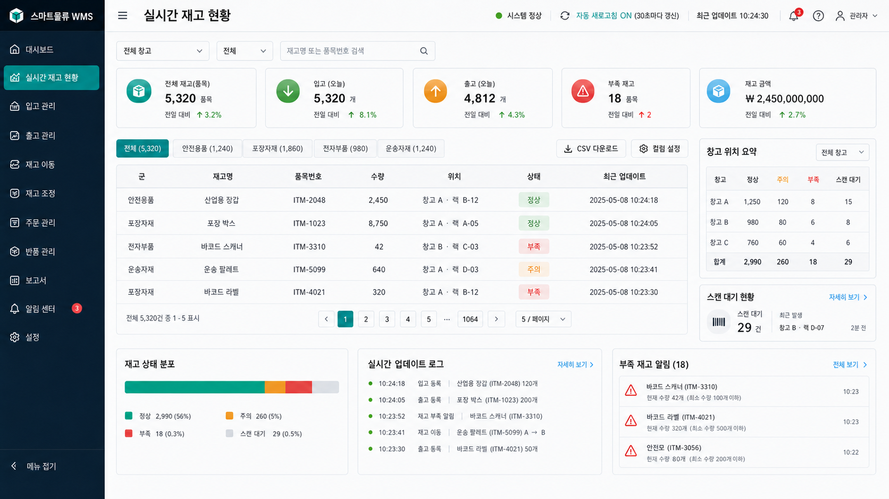
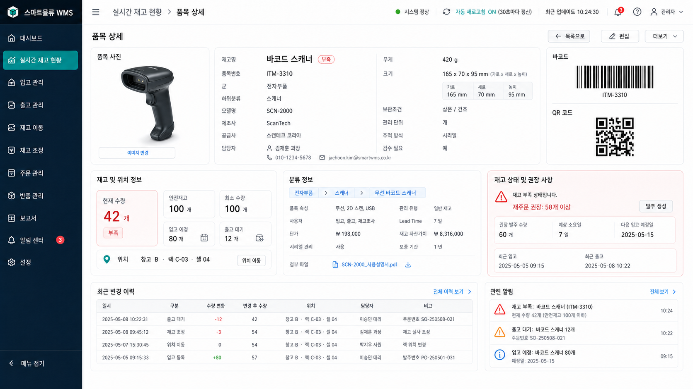

# AI-Sprint

AI-Sprint는 AI와 함께 프로젝트 주제를 정하고, 기획을 구체화하며, 산출물을 정리해 가는 활동 저장소입니다. 현재는 창고관리자와 재고관리자를 위한 **실시간 재고관리 웹 시스템**을 주제로 기획과 화면 설계를 진행하고 있습니다.

## 활동 목적

- AI를 활용해 프로젝트 아이디어를 빠르게 구체화한다.
- 초기 기획 단계에서 빠진 요구사항과 일정 리스크를 점검한다.
- 실제 사용자를 기준으로 필요한 화면과 데이터를 정의한다.
- 프로젝트 기획서, 화면 예시, Codex 스킬을 저장소에 남겨 재사용할 수 있게 한다.

## 현재 프로젝트 주제

창고관리자와 재고관리자가 재고 상태를 빠르게 파악할 수 있는 웹 기반 재고관리 시스템을 기획합니다. 사용자는 재고 목록을 군별로 확인하고, 특정 품목을 선택해 사진, 규격, 위치, 수량, 안전재고, 입출고 상태, 최근 변경 이력을 한 화면에서 볼 수 있습니다.

이 프로젝트의 1차 목표는 실제 WMS 또는 ERP 전체 기능을 모두 구현하는 것이 아니라, 재고 현황 파악과 품목 상세 조회에 집중한 MVP를 설계하는 것입니다.

## 진행 중인 활동

- 프로젝트 주제 선정 및 문제 정의
- 대상 사용자와 사용 시나리오 정리
- MVP 범위와 후순위 기능 구분
- 실시간 재고 현황 대시보드 기획
- 품목 상세 화면 기획
- 재고 데이터 항목 정의
- AI 협업용 Codex 스킬 작성 및 저장소 반영

## 핵심 기능 기획

- 재고명, 수량, 품목번호, 위치를 실시간으로 확인한다.
- 품목을 군별로 분류해 빠르게 필터링한다.
- 자동 새로고침으로 최신 재고 상태를 보여준다.
- 품목 상세 화면에서 사진, 무게, 크기, 분류, 위치, 재고 기준 정보를 확인한다.
- 부족 재고, 입고 예정, 출고 대기, 최근 변경 이력을 함께 제공한다.

## 산출물

- [프로젝트 기획서](docs/project-plan.md)
- 실시간 재고 현황 화면 예시
- 품목 상세 화면 예시
- 프로젝트 기획을 돕는 Codex 스킬

## Codex 스킬

이 저장소에는 프로젝트 초기에 사용할 수 있는 Codex 스킬도 함께 포함되어 있습니다.

- `clarify-thinking`: 모호한 아이디어를 구체화하기 위해 필요한 질문을 이어서 던지는 스킬
- `review-project-plan`: 프로젝트 주제, 기획안, 일정에서 빠진 부분과 실행 리스크를 검토하는 스킬

## 화면 예시

### 실시간 재고 현황

### 품목 상세

